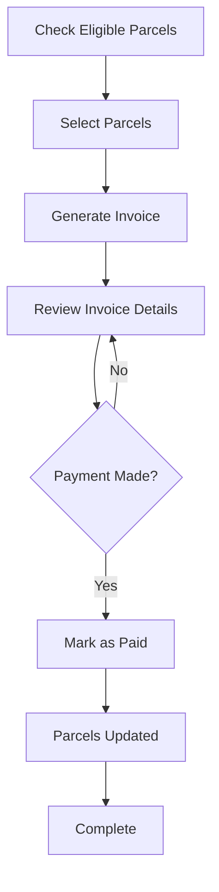

# Merchant Invoice System - Quick Reference

## 🎯 API Endpoints Summary

| Method | Endpoint | Role | Description |
|--------|----------|------|-------------|
| **GET** | `/merchant-invoices/eligible-parcels` | Merchant/Admin | Get parcels ready for invoicing |
| **POST** | `/merchant-invoices` | Admin | Generate invoice |
| **GET** | `/merchant-invoices` | Merchant/Admin | List all invoices (paginated) |
| **GET** | `/merchant-invoices/:id` | Merchant/Admin | Get invoice details |
| **POST** | `/merchant-invoices/:id/pay` | Admin | Mark invoice as paid |

---

## 📝 Quick Examples

### 1. Get Eligible Parcels

```bash
curl -X GET "http://localhost:3000/merchant-invoices/eligible-parcels?merchant_id=merchant-uuid-123" \
  -H "Authorization: Bearer YOUR_ADMIN_TOKEN"
```

### 2. Generate Invoice

```bash
curl -X POST "http://localhost:3000/merchant-invoices" \
  -H "Authorization: Bearer YOUR_ADMIN_TOKEN" \
  -H "Content-Type: application/json" \
  -d '{
    "merchant_id": "merchant-uuid-123",
    "parcel_ids": ["parcel-1", "parcel-2", "parcel-3"]
  }'
```

### 3. Get Invoice List

```bash
curl -X GET "http://localhost:3000/merchant-invoices?page=1&limit=10&invoice_status=GENERATED" \
  -H "Authorization: Bearer YOUR_TOKEN"
```

### 4. Get Invoice Details

```bash
curl -X GET "http://localhost:3000/merchant-invoices/invoice-uuid-456" \
  -H "Authorization: Bearer YOUR_TOKEN"
```

### 5. Mark Invoice as Paid

```bash
curl -X POST "http://localhost:3000/merchant-invoices/invoice-uuid-456/pay" \
  -H "Authorization: Bearer YOUR_ADMIN_TOKEN" \
  -H "Content-Type: application/json" \
  -d '{
    "payment_reference": "BANK-TRX-123456",
    "notes": "Paid via bank transfer"
  }'
```

---

## 💰 Financial Calculation

```
Net Payable = COD Collected - Delivery Charge - Return Charge

Where:
- Delivery Charge: Only if delivery_charge_applicable = true
- Return Charge: Only if return_charge_applicable = true
```

### Examples:

| Scenario | COD | Delivery | Return | Net Payable |
|----------|-----|----------|--------|-------------|
| Delivered | ৳5,000 | ৳155 ✓ | ৳0 | ৳4,845 |
| Returned | ৳0 | ৳60 ✗ | ৳80 ✓ | -৳80 |
| Partial | ৳3,000 | ৳155 ✓ | ৳0 | ৳2,845 |

---

## 🔄 Status Flow

### Parcel Financial Status

```
PENDING → INVOICED → PAID
         ↓
    CLEARANCE_PENDING → CLEARANCE_INVOICED → SETTLED
```

### Invoice Status

```
GENERATED → PAID
         ↓
      CANCELLED
```

---

## 🗄️ Key Database Fields

### Parcels Table (New Fields)

```sql
cod_collected_amount      DECIMAL(10,2)  -- Actual collected
return_charge            DECIMAL(10,2)  -- Return charge
delivery_charge_applicable  BOOLEAN     -- Apply delivery charge?
return_charge_applicable    BOOLEAN     -- Apply return charge?
financial_status         VARCHAR(50)    -- PENDING, INVOICED, PAID
invoice_id              UUID           -- Link to invoice
paid_amount             DECIMAL(10,2)  -- Amount paid
```

### Merchant Invoices Table

```sql
invoice_no              VARCHAR(50)    -- INV-2024-12-0001
merchant_id            UUID
total_parcels          INTEGER
total_cod_collected    DECIMAL(12,2)
total_delivery_charges DECIMAL(12,2)
total_return_charges   DECIMAL(12,2)
payable_amount         DECIMAL(12,2)  -- Net amount
invoice_status         VARCHAR(50)    -- GENERATED, PAID
paid_at               TIMESTAMP
paid_by               UUID
```

---

## ✅ Validation Rules

### Generate Invoice

- ✅ All parcels must belong to merchant
- ✅ Parcels must not be already invoiced (`invoice_id` IS NULL)
- ✅ Parcels must not be paid (`paid_to_merchant` = false)
- ✅ At least 1 parcel required
- ✅ Transaction is atomic

### Mark as Paid

- ✅ Invoice must exist
- ✅ Invoice status must be GENERATED
- ✅ Updates all parcels in invoice atomically

---

## 🔒 Authorization Matrix

| Action | Merchant | Admin |
|--------|----------|-------|
| View eligible parcels (own) | ✅ | ✅ |
| View eligible parcels (all) | ❌ | ✅ |
| Generate invoice | ❌ | ✅ |
| View invoices (own) | ✅ | ✅ |
| View invoices (all) | ❌ | ✅ |
| Mark as paid | ❌ | ✅ |

---

## 🚨 Common Errors

| Error | Cause | Solution |
|-------|-------|----------|
| "Parcels already invoiced" | Trying to invoice same parcel twice | Check `invoice_id` is NULL |
| "Invoice not in GENERATED status" | Trying to pay already paid invoice | Check invoice status first |
| "Unauthorized access" | Merchant accessing other's invoice | Use correct merchant_id |
| "Some parcels not found" | Invalid parcel IDs | Verify parcel IDs exist |

---

## 📊 Invoice Number Format

```
INV-YYYY-MM-XXXX

Examples:
- INV-2024-12-0001
- INV-2024-12-0034
- INV-2025-01-0001
```

Sequential per month, auto-generated.

---

## 🎯 Typical Workflow



**Steps:**
1. Admin checks eligible parcels for a merchant
2. Admin selects parcels and generates invoice
3. Admin reviews invoice details and breakdown
4. When payment is made, admin marks invoice as paid
5. System automatically updates all parcels

---

## 🔧 Testing Commands

### Run Build
```bash
npm run build
```

### Run Migration
```bash
npm run typeorm:migrate
```

### Check Migration Status
```bash
npm run typeorm migration:show
```

### Rollback Last Migration
```bash
npm run typeorm migration:revert
```

---

## 📁 File Structure

```
src/
├── common/
│   └── enums/
│       └── financial-status.enum.ts
├── merchant/
│   ├── entities/
│   │   └── merchant-invoice.entity.ts
│   ├── services/
│   │   ├── merchant-invoice.service.ts
│   │   └── invoice-calculation.service.ts
│   ├── controllers/
│   │   └── merchant-invoice.controller.ts
│   ├── dto/
│   │   ├── generate-invoice.dto.ts
│   │   ├── pay-invoice.dto.ts
│   │   └── invoice-query.dto.ts
│   └── merchant.module.ts
├── parcels/
│   └── entities/
│       └── parcel.entity.ts (updated)
└── migrations/
    └── 1735200000000-AddInvoiceSystemFields.ts
```

---

## 🎉 Ready to Use!

All endpoints are implemented and tested. Database migrations have been run successfully.

**Base URL:** `http://localhost:3000/merchant-invoices`

**Documentation:** See `MERCHANT_INVOICE_API_DOCUMENTATION.md` for detailed API specs.

