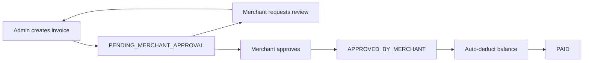

# Advance Payments — API Documentation

This document describes the advance payments feature end-to-end: endpoints, request/response examples, DTOs/entity fields, state transitions, finance interactions, common errors, and usage examples.

**Quick Links**
- Controller: [src/advance-payments/advance-payments.controller.ts](src/advance-payments/advance-payments.controller.ts#L1)
- Service: [src/advance-payments/advance-payments.service.ts](src/advance-payments/advance-payments.service.ts#L1)
- Entity: [src/advance-payments/entities/advance-payment.entity.ts](src/advance-payments/entities/advance-payment.entity.ts#L1)
- Finance handler: [src/merchant-finance/merchant-finance.service.ts](src/merchant-finance/merchant-finance.service.ts#L1360)
- Finance enums: [src/common/enums/finance-transaction-type.enum.ts](src/common/enums/finance-transaction-type.enum.ts#L1)

---

## Overview
Admins can create manual advance invoices for merchants. Merchants must review and either approve or request review. If a merchant requests a review, the admin can either approve the review with adjustments or reject it. After the invoice is accepted by the merchant, the system automatically deducts the amount from the merchant's balance.

Actors & Roles
- Admin: create/update/review invoices.
- Merchant: view their invoices and `APPROVE` or `REQUEST_REVIEW`.

Authentication & Authorization
- All endpoints are protected by `JwtAuthGuard` and `RolesGuard`.
- Admin endpoints require role `ADMIN`.
- Merchant endpoints require role `MERCHANT`.

---

## Endpoints

Notes: include `Authorization: Bearer <token>` header for all requests.

### 1) Create Advance Invoice (Admin)
- Method: POST
- Path: `/advance-payments/admin/create/invoice`
- Role: `ADMIN`
- Body: `CreateAdvancePaymentDto` (see DTOs section)

Request example:
```json
{
  "merchant_id": "<merchant-uuid>",
  "total_parcels": 24,
  "payment_method": "BANK_ACCOUNT",
  "total_collectable_amount": 15000,
  "delivery_fee": 1000,
  "cod_charge": 400,
  "previous_weight_charge": 600,
  "return_amount": 0,
  "update_amount": 0,
  "hold_amount": 0,
  "hold_pay": 0,
  "admin_note": "Advance for May shipments"
}
```

Successful response (201 Created): created `AdvancePayment` entity JSON (example):
```json
{
  "id": "uuid",
  "invoice_id": "ADV-260506-001",
  "merchant_id": "<merchant-uuid>",
  "total_parcels": 24,
  "payment_method": "BANK_ACCOUNT",
  "total_collectable_amount": "15000.00",
  "delivery_fee": "1000.00",
  "cod_charge": "400.00",
  "previous_weight_charge": "600.00",
  "return_amount": "0.00",
  "net_amount_paid": "12500.00",
  "status": "PENDING_MERCHANT_APPROVAL",
  "is_paid": false,
  "created_at": "2026-05-03T09:15:00.000Z"
}
```

Errors:
- `404 NotFound`: merchant not found
- `403 Forbidden`: merchant has `is_advance_payment_disabled` true
- `400 BadRequest`: validation errors

---

### 2) List Advance Invoices (Admin)
- Method: GET
- Path: `/advance-payments/admin/invoice/list`
- Role: `ADMIN`
- Query params (`GetAdvancePaymentsQueryDto` + pagination): `page`, `limit`, `status`, `merchant_id`, `start_date`, `end_date`, `sortBy`, `order`

Response (200 OK):
```json
{
  "success": true,
  "data": [ /* array of minimal items */ ],
  "pagination": { "total": 42, "page":1, "limit":10, "totalPages":5 },
  "message": "Advance payments retrieved successfully"
}
```

---

### 3) Get Advance Invoice (Admin)
- Method: GET
- Path: `/advance-payments/admin/invoice/:id`
- Role: `ADMIN`

Response: full invoice detail (see `findOne` mapping in service). Example keys: `breakdown`, `merchant`, `payment_method`, `admin_note`, `merchant_review_note`, `created_by`.

---

### 4) Update Advance Invoice (Admin)
- Method: PATCH
- Path: `/advance-payments/admin/invoice/:id/update`
- Role: `ADMIN`
- Body: `UpdateAdvancePaymentDto` (same fields as create, but all optional)

Behavior:
- Recalculates `net_amount_paid`.
- Resets `status` to `PENDING_MERCHANT_APPROVAL` (requires re-approval).
- Cannot update if `is_paid` is `true`.

Errors:
- `400 BadRequest` if invoice already paid
- `403 Forbidden` if merchant advance disabled

---

### 5) Review Merchant Request (Admin)
- Method: PATCH
- Path: `/advance-payments/admin/invoice/:id/review`
- Role: `ADMIN`
- Body: `ReviewAdvancePaymentDto`

Request example:
```json
{
  "action": "APPROVE",
  "total_collectable_amount": 15200,
  "delivery_fee": 900,
  "admin_note": "Adjusted after verifying the mismatch"
}
```

Behavior:
- Can only be used when the invoice is in `MERCHANT_REVIEW_REQUESTED`.
- `APPROVE`: applies any provided adjustments, recalculates `net_amount_paid`, stores the admin note, and returns the invoice to `PENDING_MERCHANT_APPROVAL` so the merchant can approve the updated data.
- `REJECT`: keeps the current invoice data, stores the admin note, and returns the invoice to `PENDING_MERCHANT_APPROVAL` so the merchant can still accept the invoice if they agree with the current values.

Errors:
- `400 BadRequest` if the invoice is not in review status
- `400 BadRequest` if `action = REJECT` and `admin_note` is missing
- `403 Forbidden` if merchant advance is disabled

---

### 6) Pay Advance Invoice (Admin, legacy)
- Method: PATCH
- Path: `/advance-payments/admin/invoice/:id/pay`
- Role: `ADMIN`

This endpoint exists for backward compatibility, but the normal flow no longer requires it. Merchant approval now triggers the balance deduction automatically.

Preconditions:
- Invoice `status` must be `APPROVED_BY_MERCHANT`.
- Invoice `is_paid` must be `false`.
- Merchant must have `is_advance_payment_disabled` = false.

Behavior on success:
- Calls `MerchantFinanceService.createTransaction()` with `transaction_type = ADVANCE_PAYMENT` and `amount = -Math.abs(net_amount_paid)` (negative to reduce merchant balance).
- Sets `status` -> `PAID`, `is_paid` -> `true`, `paid_at` -> now.

Success response: updated `AdvancePayment` (status PAID) or confirmation message.

Errors:
- `400 BadRequest` if status not approved or already paid
- `403 Forbidden` if merchant disabled
- `404 NotFound` if invoice not found

---

### 7) Merchant: List Own Invoices
- Method: GET
- Path: `/advance-payments/merchant/invoice/list`
- Role: `MERCHANT`
- Behavior: forced filter by the calling merchant's ID; supports pagination and query filters.

---

### 8) Merchant: Get Invoice
- Method: GET
- Path: `/advance-payments/merchant/invoice/:id`
- Role: `MERCHANT`
- Behavior: ownership check — merchant can only access their own invoice.

---

### 9) Merchant: Action on Invoice
- Method: PATCH
- Path: `/advance-payments/merchant/invoice/:id/action`
- Role: `MERCHANT`
- Body: `MerchantActionDto` — `action` = `APPROVE` or `REQUEST_REVIEW`, `review_note` required when `REQUEST_REVIEW`.

Behavior:
- Only allowed when invoice in `PENDING_MERCHANT_APPROVAL`.
- On `APPROVE`: status -> `APPROVED_BY_MERCHANT`, `merchant_review_note` cleared.
- On `REQUEST_REVIEW`: status -> `MERCHANT_REVIEW_REQUESTED`, `merchant_review_note` set.

Errors:
- `400 BadRequest` if not allowed in current status or required `review_note` missing
- `403` / `400` if merchant is not the owner

---

## DTOs & Entity Fields

### `CreateAdvancePaymentDto`
- `merchant_id` (UUID, required)
- `total_parcels` (number, required)
- `payment_method` (string, required)
- `total_collectable_amount` (number, required)
- `delivery_fee` (number, required)
- `cod_charge` (number, required)
- `previous_weight_charge` (number, required)
- `return_amount` (number, required)
- `admin_note` (string, optional)
 - `update_amount` (number, optional)
 - `hold_amount` (number, optional)
 - `hold_pay` (number, optional)

Aliases accepted by the API (the DTO accepts these alternative names):
- `collectable_amount` or `collectableAmount` → `total_collectable_amount`
- `delivery_charge` or `deliveryFee` → `delivery_fee`
- `return_charge` or `returnAmount` → `return_amount`
- `prev_weight_charge` or `previousWeightCharge` → `previous_weight_charge`
- `codCharge` → `cod_charge`

See DTO: [src/advance-payments/dto/create-advance.dto.ts](src/advance-payments/dto/create-advance.dto.ts#L1)

### `MerchantActionDto`
- `action`: `APPROVE` | `REQUEST_REVIEW`
- `review_note`: string (optional — required for `REQUEST_REVIEW`)

See DTO: [src/advance-payments/dto/merchant-action.dto.ts](src/advance-payments/dto/merchant-action.dto.ts#L1)

### `AdvancePayment` Entity (stored table `advance_payments`)
Key columns:
- `id` (uuid)
- `invoice_id` (varchar, unique)
- `merchant_id` (uuid)
- `created_by_id` (uuid)
- `total_parcels` (int)
- `payment_method` (varchar)
- `total_collectable_amount` (decimal)
- `delivery_fee` (decimal)
- `cod_charge` (decimal)
- `previous_weight_charge` (decimal)
- `return_amount` (decimal)
- `net_amount_paid` (decimal) — calculated on create/update
- `status` (enum) — values: `PENDING_MERCHANT_APPROVAL`, `MERCHANT_REVIEW_REQUESTED`, `APPROVED_BY_MERCHANT`, `PAID`, `CANCELLED`
- `merchant_review_note`, `admin_note` (text)
- `is_paid` (boolean), `paid_at` (timestamp)
- `created_at`, `updated_at`

See entity: [src/advance-payments/entities/advance-payment.entity.ts](src/advance-payments/entities/advance-payment.entity.ts#L1)

---

## State Transitions

Sequence (happy path):
1. `PENDING_MERCHANT_APPROVAL` (after Admin create)
2. `APPROVED_BY_MERCHANT` (after Merchant approves)
3. `PAID` (auto-deducted immediately after Merchant approves)

Alternate path:
- Merchant requests review: `PENDING_MERCHANT_APPROVAL` -> `MERCHANT_REVIEW_REQUESTED` -> Admin reviews -> back to `PENDING_MERCHANT_APPROVAL`

Mermaid diagram:


---

## Finance Interaction (what paying does)
When Merchant approves an invoice, the system:
1. Verifies invoice `status === APPROVED_BY_MERCHANT` and `is_paid === false`.
2. Calls `MerchantFinanceService.createTransaction()` with:
   - `merchant_id`: the merchant's user id (see `advance.merchant.user_id` in code)
   - `amount`: `-Math.abs(net_amount_paid)` (negative to deduct)
   - `transaction_type`: `ADVANCE_PAYMENT`
   - `reference_type`: `ADVANCE_PAYMENT`
   - `reference_id`: advance invoice id
   - `created_by`: admin user id

See code: [src/advance-payments/advance-payments.service.ts](src/advance-payments/advance-payments.service.ts#L100) and finance method: [src/merchant-finance/merchant-finance.service.ts](src/merchant-finance/merchant-finance.service.ts#L1360).

`MerchantFinanceService.createTransaction()` behavior:
- Validates merchant exists and advance payments are allowed.
- Updates `MerchantFinance.current_balance` by adding `dto.amount` (passing negative reduces balance) within a DB transaction.
- Creates a `MerchantFinanceTransaction` record with `transaction_type` set to `ADVANCE_PAYMENT`.

This ensures accounting consistency and transaction history.

---

## Common Errors and Causes
- `NotFoundException` (404): Merchant or Invoice not found.
- `ForbiddenException` (403): Merchant has `is_advance_payment_disabled` or access denied.
- `BadRequestException` (400): Invalid status transitions (e.g., approving before merchant review is resolved), validation errors, merchant ownership mismatch.

---

## Proper Flow

The intended flow is:
1. Admin creates the advance invoice.
2. Merchant reviews the invoice.
3. If the invoice is correct, the merchant approves it.
4. On merchant approval, the system immediately deducts the amount from the merchant balance and marks the invoice as paid.
5. If the merchant sees a mismatch, they request review with a note.
6. Admin reviews the request, adjusts the invoice if needed, or rejects the review with a note.
7. The updated invoice goes back to merchant approval.
8. Once the merchant approves the updated invoice, the balance is deducted automatically.

## Request and Response Examples

### Create Advance Invoice
Request body:
```json
{
  "merchant_id": "uuid",
  "total_parcels": 24,
  "payment_method": "BANK_ACCOUNT",
  "total_collectable_amount": 15000,
  "delivery_fee": 1000,
  "cod_charge": 400,
  "previous_weight_charge": 600,
  "return_amount": 0,
  "update_amount": 0,
  "hold_amount": 0,
  "hold_pay": 0,
  "admin_note": "Advance for May shipments"
}
```

Response body:
```json
{
  "id": "uuid",
  "invoice_id": "ADV-260506-001",
  "merchant_id": "uuid",
  "total_parcels": 24,
  "payment_method": "BANK_ACCOUNT",
  "total_collectable_amount": "15000.00",
  "delivery_fee": "1000.00",
  "cod_charge": "400.00",
  "previous_weight_charge": "600.00",
  "return_amount": "0.00",
  "update_amount": "0.00",
  "hold_amount": "0.00",
  "hold_pay": "0.00",
  "net_amount_paid": "12500.00",
  "status": "PENDING_MERCHANT_APPROVAL",
  "merchant_review_note": null,
  "admin_note": "Advance for May shipments",
  "is_paid": false,
  "paid_at": null,
  "created_at": "2026-05-03T09:15:00.000Z",
  "updated_at": "2026-05-03T09:15:00.000Z"
}
```

### Merchant Action: Approve
Request body:
```json
{
  "action": "APPROVE"
}
```

Response body:
```json
{
  "id": "uuid",
  "invoice_id": "ADV-260506-001",
  "status": "PAID",
  "is_paid": true,
  "paid_at": "2026-05-03T10:00:00.000Z",
  "merchant_review_note": null
}
```

### Merchant Action: Request Review
Request body:
```json
{
  "action": "REQUEST_REVIEW",
  "review_note": "The return charge looks higher than expected"
}
```

Response body:
```json
{
  "id": "uuid",
  "invoice_id": "ADV-260506-001",
  "status": "MERCHANT_REVIEW_REQUESTED",
  "is_paid": false,
  "merchant_review_note": "The return charge looks higher than expected"
}
```

### Admin Review: Approve with Adjustment
Request body:
```json
{
  "action": "APPROVE",
  "total_collectable_amount": 15200,
  "delivery_fee": 900,
  "admin_note": "Adjusted after verifying the mismatch"
}
```

Response body:
```json
{
  "id": "uuid",
  "invoice_id": "ADV-260506-001",
  "status": "PENDING_MERCHANT_APPROVAL",
  "net_amount_paid": "12900.00",
  "admin_note": "Adjusted after verifying the mismatch"
}
```

### Admin Review: Reject
Request body:
```json
{
  "action": "REJECT",
  "admin_note": "No adjustment needed after checking the source data"
}
```

Response body:
```json
{
  "id": "uuid",
  "invoice_id": "ADV-260506-001",
  "status": "PENDING_MERCHANT_APPROVAL",
  "admin_note": "No adjustment needed after checking the source data"
}
```

### Legacy Admin Pay
Request body:
```json
{}
```

Response body:
```json
{
  "id": "uuid",
  "invoice_id": "ADV-260506-001",
  "status": "PAID",
  "is_paid": true,
  "paid_at": "2026-05-03T10:00:00.000Z"
}
```

## Notes

- `MERCHANT_REVIEW_REQUESTED` means the merchant found a mismatch and asked for admin review.
- `PENDING_MERCHANT_APPROVAL` means the invoice is ready for the merchant to approve again.
- `APPROVED_BY_MERCHANT` is the final approval state before automatic deduction.
- The automatic deduction happens during merchant approval; the admin pay route is legacy only.
- `merchant_review_note` stores the merchant's mismatch note.
- `admin_note` stores the admin's explanation or adjustment note.
- All numeric totals are recalculated from the invoice fields on create and update.

## Reference

- Controller & endpoints: [src/advance-payments/advance-payments.controller.ts](src/advance-payments/advance-payments.controller.ts#L1)
- Core business logic: [src/advance-payments/advance-payments.service.ts](src/advance-payments/advance-payments.service.ts#L1)
- Database model: [src/advance-payments/entities/advance-payment.entity.ts](src/advance-payments/entities/advance-payment.entity.ts#L1)
- Finance integration: [src/merchant-finance/merchant-finance.service.ts](src/merchant-finance/merchant-finance.service.ts#L1360)

