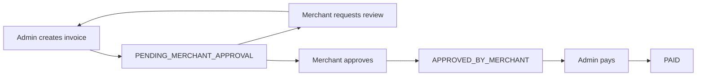

# Advance Payments — API Documentation

This document describes the advance payments feature end-to-end: endpoints, request/response examples, DTOs/entity fields, state transitions, finance interactions, common errors, and usage examples.

**Quick Links**
- Controller: [src/advance-payments/advance-payments.controller.ts](src/advance-payments/advance-payments.controller.ts#L1)
- Service: [src/advance-payments/advance-payments.service.ts](src/advance-payments/advance-payments.service.ts#L1)
- Entity: [src/advance-payments/entities/advance-payment.entity.ts](src/advance-payments/entities/advance-payment.entity.ts#L1)
- Finance handler: [src/merchant-finance/merchant-finance.service.ts](src/merchant-finance/merchant-finance.service.ts#L1360)
- Finance enums: [src/common/enums/finance-transaction-type.enum.ts](src/common/enums/finance-transaction-type.enum.ts#L1)

---

## Overview
Admins can create manual advance invoices for merchants. Merchants must review and either approve or request review. After merchant approval, an admin marks the invoice as paid. Paying triggers a finance transaction that reduces the merchant's balance.

Actors & Roles
- Admin: create/update/pay invoices.
- Merchant: view their invoices and `APPROVE` or `REQUEST_REVIEW`.

Authentication & Authorization
- All endpoints are protected by `JwtAuthGuard` and `RolesGuard`.
- Admin endpoints require role `ADMIN`.
- Merchant endpoints require role `MERCHANT`.

---

## Endpoints

Notes: include `Authorization: Bearer <token>` header for all requests.

### 1) Create Advance Invoice (Admin)
- Method: POST
- Path: `/advance-payments/admin/create/invoice`
- Role: `ADMIN`
- Body: `CreateAdvancePaymentDto` (see DTOs section)

Request example:
```json
{
  "merchant_id": "<merchant-uuid>",
  "total_parcels": 24,
  "payment_method": "BANK_ACCOUNT",
  "total_collectable_amount": 15000,
  "delivery_fee": 1000,
  "cod_charge": 400,
  "previous_weight_charge": 600,
  "return_amount": 0,
  "update_amount": 0,
  "hold_amount": 0,
  "hold_pay": 0,
  "admin_note": "Advance for May shipments"
}
```

Successful response (201 Created): created `AdvancePayment` entity JSON (example):
```json
{
  "id": "uuid",
  "invoice_id": "ADV-260506-001",
  "merchant_id": "<merchant-uuid>",
  "total_parcels": 24,
  "payment_method": "BANK_ACCOUNT",
  "total_collectable_amount": "15000.00",
  "delivery_fee": "1000.00",
  "cod_charge": "400.00",
  "previous_weight_charge": "600.00",
  "return_amount": "0.00",
  "net_amount_paid": "12500.00",
  "status": "PENDING_MERCHANT_APPROVAL",
  "is_paid": false,
  "created_at": "2026-05-03T09:15:00.000Z"
}
```

Errors:
- `404 NotFound`: merchant not found
- `403 Forbidden`: merchant has `is_advance_payment_disabled` true
- `400 BadRequest`: validation errors

---

### 2) List Advance Invoices (Admin)
- Method: GET
- Path: `/advance-payments/admin/invoice/list`
- Role: `ADMIN`
- Query params (`GetAdvancePaymentsQueryDto` + pagination): `page`, `limit`, `status`, `merchant_id`, `start_date`, `end_date`, `sortBy`, `order`

Response (200 OK):
```json
{
  "success": true,
  "data": [ /* array of minimal items */ ],
  "pagination": { "total": 42, "page":1, "limit":10, "totalPages":5 },
  "message": "Advance payments retrieved successfully"
}
```

---

### 3) Get Advance Invoice (Admin)
- Method: GET
- Path: `/advance-payments/admin/invoice/:id`
- Role: `ADMIN`

Response: full invoice detail (see `findOne` mapping in service). Example keys: `breakdown`, `merchant`, `payment_method`, `admin_note`, `merchant_review_note`, `created_by`.

---

### 4) Update Advance Invoice (Admin)
- Method: PATCH
- Path: `/advance-payments/admin/invoice/:id/update`
- Role: `ADMIN`
- Body: same as `CreateAdvancePaymentDto`

Behavior:
- Recalculates `net_amount_paid`.
- Resets `status` to `PENDING_MERCHANT_APPROVAL` (requires re-approval).
- Cannot update if `is_paid` is `true`.

Errors:
- `400 BadRequest` if invoice already paid
- `403 Forbidden` if merchant advance disabled

---

### 5) Pay Advance Invoice (Admin)
- Method: PATCH
- Path: `/advance-payments/admin/invoice/:id/pay`
- Role: `ADMIN`

Preconditions:
- Invoice `status` must be `APPROVED_BY_MERCHANT`.
- Invoice `is_paid` must be `false`.
- Merchant must have `is_advance_payment_disabled` = false.

Behavior on success:
- Calls `MerchantFinanceService.createTransaction()` with `transaction_type = ADVANCE_PAYMENT` and `amount = -Math.abs(net_amount_paid)` (negative to reduce merchant balance).
- Sets `status` -> `PAID`, `is_paid` -> `true`, `paid_at` -> now.

Success response: updated `AdvancePayment` (status PAID) or confirmation message.

Errors:
- `400 BadRequest` if status not approved or already paid
- `403 Forbidden` if merchant disabled
- `404 NotFound` if invoice not found

---

### 6) Merchant: List Own Invoices
- Method: GET
- Path: `/advance-payments/merchant/invoice/list`
- Role: `MERCHANT`
- Behavior: forced filter by the calling merchant's ID; supports pagination and query filters.

---

### 7) Merchant: Get Invoice
- Method: GET
- Path: `/advance-payments/merchant/invoice/:id`
- Role: `MERCHANT`
- Behavior: ownership check — merchant can only access their own invoice.

---

### 8) Merchant: Action on Invoice
- Method: PATCH
- Path: `/advance-payments/merchant/invoice/:id/action`
- Role: `MERCHANT`
- Body: `MerchantActionDto` — `action` = `APPROVE` or `REQUEST_REVIEW`, `review_note` required when `REQUEST_REVIEW`.

Behavior:
- Only allowed when invoice in `PENDING_MERCHANT_APPROVAL`.
- On `APPROVE`: status -> `APPROVED_BY_MERCHANT`, `merchant_review_note` cleared.
- On `REQUEST_REVIEW`: status -> `MERCHANT_REVIEW_REQUESTED`, `merchant_review_note` set.

Errors:
- `400 BadRequest` if not allowed in current status or required `review_note` missing
- `403` / `400` if merchant is not the owner

---

## DTOs & Entity Fields

### `CreateAdvancePaymentDto`
- `merchant_id` (UUID, required)
- `total_parcels` (number, required)
- `payment_method` (string, required)
- `total_collectable_amount` (number, required)
- `delivery_fee` (number, required)
- `cod_charge` (number, required)
- `previous_weight_charge` (number, required)
- `return_amount` (number, required)
- `admin_note` (string, optional)
 - `update_amount` (number, optional)
 - `hold_amount` (number, optional)
 - `hold_pay` (number, optional)

Aliases accepted by the API (the DTO accepts these alternative names):
- `collectable_amount` or `collectableAmount` → `total_collectable_amount`
- `delivery_charge` or `deliveryFee` → `delivery_fee`
- `return_charge` or `returnAmount` → `return_amount`
- `prev_weight_charge` or `previousWeightCharge` → `previous_weight_charge`
- `codCharge` → `cod_charge`

See DTO: [src/advance-payments/dto/create-advance.dto.ts](src/advance-payments/dto/create-advance.dto.ts#L1)

### `MerchantActionDto`
- `action`: `APPROVE` | `REQUEST_REVIEW`
- `review_note`: string (optional — required for `REQUEST_REVIEW`)

See DTO: [src/advance-payments/dto/merchant-action.dto.ts](src/advance-payments/dto/merchant-action.dto.ts#L1)

### `AdvancePayment` Entity (stored table `advance_payments`)
Key columns:
- `id` (uuid)
- `invoice_id` (varchar, unique)
- `merchant_id` (uuid)
- `created_by_id` (uuid)
- `total_parcels` (int)
- `payment_method` (varchar)
- `total_collectable_amount` (decimal)
- `delivery_fee` (decimal)
- `cod_charge` (decimal)
- `previous_weight_charge` (decimal)
- `return_amount` (decimal)
- `net_amount_paid` (decimal) — calculated on create/update
- `status` (enum) — values: `PENDING_MERCHANT_APPROVAL`, `MERCHANT_REVIEW_REQUESTED`, `APPROVED_BY_MERCHANT`, `PAID`, `CANCELLED`
- `merchant_review_note`, `admin_note` (text)
- `is_paid` (boolean), `paid_at` (timestamp)
- `created_at`, `updated_at`

See entity: [src/advance-payments/entities/advance-payment.entity.ts](src/advance-payments/entities/advance-payment.entity.ts#L1)

---

## State Transitions

Sequence (happy path):
1. `PENDING_MERCHANT_APPROVAL` (after Admin create)
2. `APPROVED_BY_MERCHANT` (after Merchant approves)
3. `PAID` (after Admin pays)

Alternate path:
- Merchant requests review: `PENDING_MERCHANT_APPROVAL` -> `MERCHANT_REVIEW_REQUESTED` -> Admin updates -> back to `PENDING_MERCHANT_APPROVAL`

Mermaid diagram:


---

## Finance Interaction (what paying does)
When Admin marks invoice paid, the system:
1. Verifies invoice `status === APPROVED_BY_MERCHANT` and `is_paid === false`.
2. Calls `MerchantFinanceService.createTransaction()` with:
   - `merchant_id`: the merchant's user id (see `advance.merchant.user_id` in code)
   - `amount`: `-Math.abs(net_amount_paid)` (negative to deduct)
   - `transaction_type`: `ADVANCE_PAYMENT`
   - `reference_type`: `ADVANCE_PAYMENT`
   - `reference_id`: advance invoice id
   - `created_by`: admin user id

See code: [src/advance-payments/advance-payments.service.ts](src/advance-payments/advance-payments.service.ts#L160) and finance method: [src/merchant-finance/merchant-finance.service.ts](src/merchant-finance/merchant-finance.service.ts#L1360).

`MerchantFinanceService.createTransaction()` behavior:
- Validates merchant exists and advance payments are allowed.
- Updates `MerchantFinance.current_balance` by adding `dto.amount` (passing negative reduces balance) within a DB transaction.
- Creates a `MerchantFinanceTransaction` record with `transaction_type` set to `ADVANCE_PAYMENT`.

This ensures accounting consistency and transaction history.

---

## Common Errors and Causes
- `NotFoundException` (404): Merchant or Invoice not found.
- `ForbiddenException` (403): Merchant has `is_advance_payment_disabled` or access denied.
- `BadRequestException` (400): Invalid status transitions (e.g., paying before approval), validation errors, merchant ownership mismatch.

---

## Example Curl Sequence (happy path)

1) Admin create invoice
```bash
curl -X POST "{{baseUrl}}/advance-payments/admin/create/invoice" \
  -H "Authorization: Bearer $ADMIN_TOKEN" \
  -H "Content-Type: application/json" \
  -d '{
    "merchant_id":"<merchant-uuid>",
    "total_parcels":24,
    "payment_method":"BANK_ACCOUNT",
    "total_collectable_amount":15000,
    "delivery_fee":1000,
    "cod_charge":400,
    "previous_weight_charge":600,
    "return_amount":0,
    "admin_note":"Advance for May shipments"
  }'
```

2) Merchant approves
```bash
curl -X PATCH "{{baseUrl}}/advance-payments/merchant/invoice/<id>/action" \
  -H "Authorization: Bearer $MERCHANT_TOKEN" \
  -H "Content-Type: application/json" \
  -d '{ "action":"APPROVE" }'
```

3) Admin pays
```bash
curl -X PATCH "{{baseUrl}}/advance-payments/admin/invoice/<id>/pay" \
  -H "Authorization: Bearer $ADMIN_TOKEN"
```

---

## Troubleshooting & Notes
- Ensure `FinanceTransactionType` includes `ADVANCE_PAYMENT` (it does in code) and that `MerchantFinanceService.createTransaction()` handles `ADVANCE_PAYMENT` correctly.
- The code expects the `merchant_id` passed to finance methods to be the merchant's user id. Confirm token-provided merchant id aligns with `merchant.user_id` in the DB.
- Feature flag: if `merchant.is_advance_payment_disabled` is true, operations are blocked at multiple layers.

---

## Where to look in code
- Controller & endpoints: [src/advance-payments/advance-payments.controller.ts](src/advance-payments/advance-payments.controller.ts#L1)
- Core business logic: [src/advance-payments/advance-payments.service.ts](src/advance-payments/advance-payments.service.ts#L1)
- Database model: [src/advance-payments/entities/advance-payment.entity.ts](src/advance-payments/entities/advance-payment.entity.ts#L1)
- Finance integration: [src/merchant-finance/merchant-finance.service.ts](src/merchant-finance/merchant-finance.service.ts#L1360)

---

If you want, I can also:
- generate a concise Postman collection for the main endpoints,
- add example response schemas with JSON Schema, or
- run a quick grep for tests or migrations mentioning `advance_payments`.

---

**Frontend Implementation Summary**

- **Auth:** All endpoints require `Authorization: Bearer <token>` header.
- **Guards / Roles:** Admin routes use role `ADMIN`; merchant routes use role `MERCHANT`.
- **Date format:** ISO 8601 UTC strings (e.g. `2026-05-03T09:15:00.000Z`).
- **Pagination (list endpoints):** query params `page` (default 1) and `limit` (default 10). Response contains `pagination` with `total, page, limit, totalPages, hasNext, hasPrev`.

**Status enum values**

- `PENDING_MERCHANT_APPROVAL`
- `MERCHANT_REVIEW_REQUESTED`
- `APPROVED_BY_MERCHANT`
- `PAID`
- `CANCELLED`

---

**API Quick Reference (Frontend-ready)**

1) Create Advance Invoice (Admin)
- Method: POST
- Path: `/advance-payments/admin/create/invoice`
- Role: `ADMIN`
- Headers: `Authorization`, `Content-Type: application/json`
- Request body (CreateAdvancePaymentDto):

  {
    "merchant_id": "uuid",
    "total_parcels": 24,
    "payment_method": "BANK_ACCOUNT", // string
    "total_collectable_amount": 15000, // number
    "delivery_fee": 1000, // number
    "cod_charge": 400, // number
    "previous_weight_charge": 600, // number
    "return_amount": 0, // number
    "admin_note": "optional string"
  }

- Validation: `merchant_id` must be a UUID. Numeric fields are numbers and >= 0.
- Success: 201 Created — returns saved `AdvancePayment` entity (database fields). Example:

  {
    "id": "uuid",
    "invoice_id": "ADV-260506-001",
    "merchant_id": "uuid",
    "total_parcels": 24,
    "payment_method": "BANK_ACCOUNT",
    "total_collectable_amount": "15000.00",
    "delivery_fee": "1000.00",
    "cod_charge": "400.00",
    "previous_weight_charge": "600.00",
    "return_amount": "0.00",
    "net_amount_paid": "12500.00",
    "status": "PENDING_MERCHANT_APPROVAL",
    "is_paid": false,
    "created_at": "2026-05-03T09:15:00.000Z"
  }

- Errors:
  - 404 NotFound: `Merchant not found`
  - 403 Forbidden: `Advance payment feature is disabled for this merchant`
  - 400 BadRequest: validation errors

2) List Advance Invoices (Admin)
- Method: GET
- Path: `/advance-payments/admin/invoice/list`
- Role: `ADMIN`
- Query params: `page`, `limit`, `status`, `merchant_id`, `start_date`, `end_date`, `sortBy`, `order`, `search`
- Success: 200 OK

  {
    "success": true,
    "data": [ /* minimal items for list */ ],
    "pagination": { "total": 42, "page":1, "limit":10, "totalPages":5, "hasNext": false, "hasPrev": false },
    "message": "Advance payments retrieved successfully"
  }

3) Get Advance Invoice (Admin)
- Method: GET
- Path: `/advance-payments/admin/invoice/:id`
- Role: `ADMIN`
- Success: 200 OK — returns full invoice detail (see "Detail response" schema below).

4) Update Advance Invoice (Admin)
- Method: PATCH
- Path: `/advance-payments/admin/invoice/:id/update`
- Role: `ADMIN`
- Request body: same as `CreateAdvancePaymentDto`
- Behavior: recalculates `net_amount_paid`, sets `status` -> `PENDING_MERCHANT_APPROVAL`. Cannot update a paid invoice.
- Errors: 400 if invoice is already paid, 404 if not found, 403 if merchant disabled.

5) Pay Advance Invoice (Admin)
- Method: PATCH
- Path: `/advance-payments/admin/invoice/:id/pay`
- Role: `ADMIN`
- Preconditions: invoice `status === APPROVED_BY_MERCHANT` and `is_paid === false`.
- Behavior: calls `MerchantFinanceService.createTransaction()` with `amount = -Math.abs(net_amount_paid)`, `transaction_type = ADVANCE_PAYMENT` and marks invoice as paid (`status` -> `PAID`, `is_paid` -> true, `paid_at` -> now).
- Errors: 400 if not approved or already paid, 403 if merchant disabled, 404 if invoice not found.

6) Merchant: List Own Invoices
- Method: GET
- Path: `/advance-payments/merchant/invoice/list`
- Role: `MERCHANT`
- Behavior: forced to return only invoices belonging to the calling merchant. Accepts same query params as admin list (except `merchant_id` is forced).

7) Merchant: Get Invoice
- Method: GET
- Path: `/advance-payments/merchant/invoice/:id`
- Role: `MERCHANT`
- Behavior: returns detail only if the merchant owns the invoice.

8) Merchant: Action on Invoice
- Method: PATCH
- Path: `/advance-payments/merchant/invoice/:id/action`
- Role: `MERCHANT`
- Request body (MerchantActionDto):

  {
    "action": "APPROVE" | "REQUEST_REVIEW",
    "review_note": "string (required when REQUEST_REVIEW)"
  }

- Behavior: Only allowed when invoice `status === PENDING_MERCHANT_APPROVAL`.
  - `APPROVE` -> status `APPROVED_BY_MERCHANT`, clears `merchant_review_note`.
  - `REQUEST_REVIEW` -> status `MERCHANT_REVIEW_REQUESTED`, sets `merchant_review_note`.

---

**Detail response (Invoice)**

This is the mapped object returned by `GET /.../invoice/:id` (admin) and by merchant when allowed:

{
  "id": "uuid",
  "invoice_id": "ADV-...",
  "status": "PENDING_MERCHANT_APPROVAL",
  "created_at": "2026-05-03T09:15:00.000Z",
  "paid_at": null,
  "is_paid": false,
  "merchant": { "id": "uuid", "name": "Merchant Name", "phone": "017..." },
  "breakdown": {
    "total_parcels": 24,
    "total_collectable": 15000,
    "deductions": { "delivery_fee": 1000, "cod_charge": 400, "weight_charge": 600, "return_charge": 500, "update_amount": 0, "hold_amount": 0, "hold_pay": 0 },
    "net_payable": 12500
  },
  "payment_method": "BANK_ACCOUNT",
  "admin_note": "text",
  "merchant_review_note": null,
  "created_by": "Admin Name"
}

---

**JSON Schema (frontend validation helpers)**

CreateAdvancePaymentDto (JSON Schema simplified):

{
  "type": "object",
  "required": ["merchant_id","total_parcels","payment_method","total_collectable_amount","delivery_fee","cod_charge","previous_weight_charge","return_amount"],
  "properties": {
    "merchant_id": { "type": "string", "format": "uuid" },
    "total_parcels": { "type": "number", "minimum": 0 },
    "payment_method": { "type": "string" },
    "total_collectable_amount": { "type": "number" },
    "delivery_fee": { "type": "number" },
    "cod_charge": { "type": "number" },
    "previous_weight_charge": { "type": "number" },
    "return_amount": { "type": "number" },
    "update_amount": { "type": "number" },
    "hold_amount": { "type": "number" },
    "hold_pay": { "type": "number" },
    "admin_note": { "type": "string" }
  }
}

MerchantActionDto (JSON Schema simplified):

{
  "type": "object",
  "required": ["action"],
  "properties": {
    "action": { "type": "string", "enum": ["APPROVE","REQUEST_REVIEW"] },
    "review_note": { "type": "string" }
  }
}

---

**Frontend implementation notes / gotchas**

- The backend calculates `net_amount_paid` as: `total_collectable_amount - (delivery_fee + cod_charge + previous_weight_charge + return_amount)` on create and update. Frontend may re-calculate to show a preview but should not trust client-calculated net on submit.
- When merchant acts, the token-provided merchant identifier must align with the `merchant.user_id` in DB; the server enforces ownership by checking `merchant.user_id`.
- For listing, `search` supports searching by `invoice_id` (case-insensitive). Use `search` query param.
- On pay, the backend creates a negative finance transaction to reduce merchant balance. Frontend should only call pay after merchant has approved.

---

If you'd like, I can now:

- generate a small Postman collection (3 requests: create, merchant approve, admin pay) and add it under `postman/`;
- or open a PR with the doc changes and a short checklist for backend tasks (e.g., ensure `FinanceTransactionType.ADVANCE_PAYMENT` exists and migrations applied).

